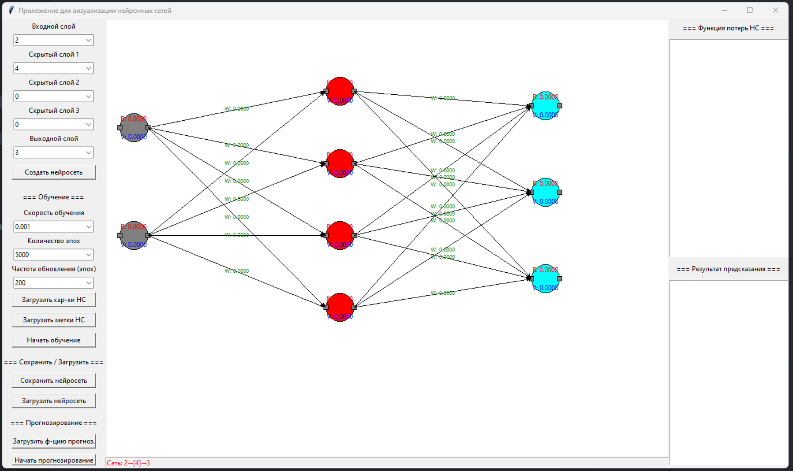

Визуализатор и конструктор нейронных сетей с графическим интерфейсом.

### Интерфейс программы

## Возможности

- Создание нейросети с настройкой слоев и нейронов
- Обучение с отображением ошибок в реальном времени
- Прогнозирование результатов
- Сохранение и загрузка обученных сетей
- Визуализация весов и смещений